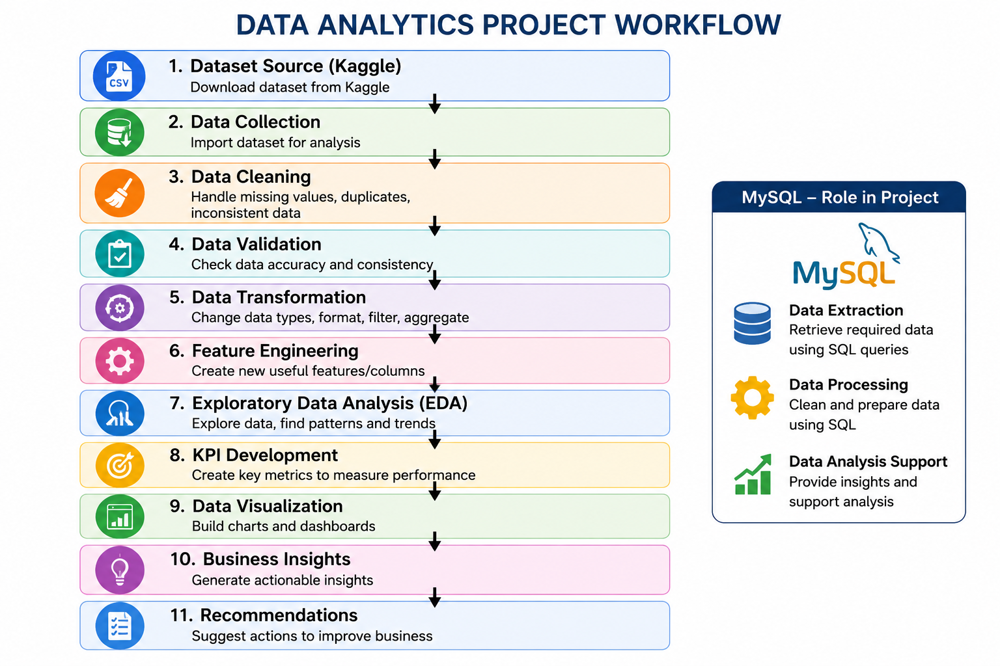

# Customer Intelligence Dashboard for E-Commerce Product Recommendations

## Project Overview
This project analyzes customer behavior, product engagement, and purchasing patterns to improve product recommendation strategies.
## Business Problem

E-commerce companies need to understand customer preferences and product performance to improve recommendation accuracy and customer engagement.

## Project Workflow

## Objectives
- Analyze customer engagement
- Identify high-performing products
- Understand geographical buying patterns
- Improve recommendation strategies

## Tools Used
- Power BI
- Excel
- SQL
- DAX
- Power Query

## Dashboard Features
- Customer Segmentation Analysis
- Product Performance Tracking
- Seasonal Trend Analysis
- Geographic Insights
- Gender-wise Customer Behavior

## Key Business Insights
1. Coastal regions generate the highest clicks.
2. Winter season shows maximum sales.
3. Male customers purchase more similar products.
4. High-rated products receive more engagement.

## Recommendations

- Increase inventory during winter season.
- Promote highly rated products.
- Focus marketing on high-engagement regions.

## Files Included
- Dataset(excel file)
- Power BI Dashboard (.pbix)
- SQL Queries(MY SQL WORKBENCH)
- Jupyter notebook(FOR DATA VISUALIZATION)

